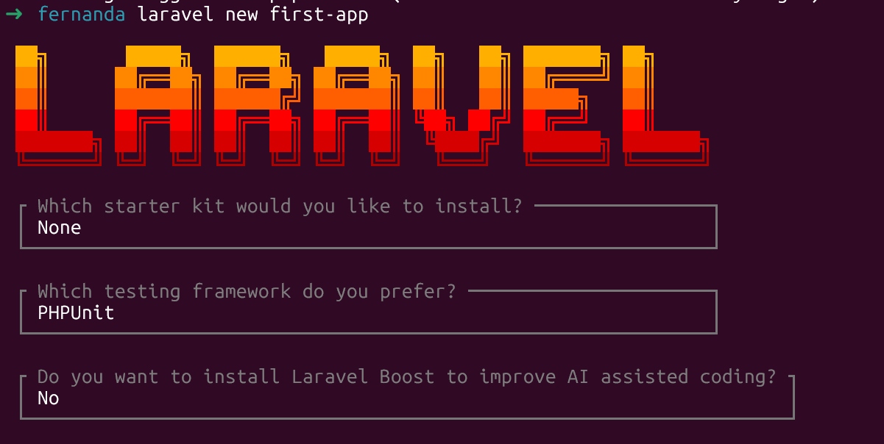
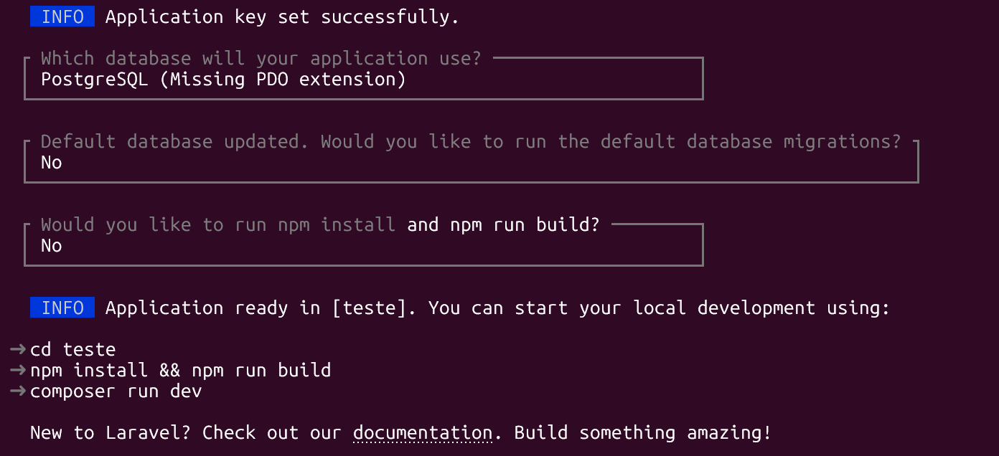

## Criando um projeto 
Com o Laravel configurado, basta usarmos o comando abaixo para criar um projeto Laravel com toda a estrutura pronta 

``laravel new first-app``

Ou seja, chamamos **laravel new** e definimos o nome do projeto.

O installer vai fazer algumas perguntas como 
- Qual starter kit usar 
- Framework de testes
- Utilização de Laravel Boost

Nesse caso, vamos escolher nenhum starter kit, PHPUnit e não vamos usar o Laravel Boost.

Além disso, é preciso informar: 
- Banco de dados utilizado 
- Se desejamos rodar as migrations 
- Se desejamos rodar os comandos npm install

Vamos usar o PostgreSQL e não vamos rodar as migrations por agora e nem os comandos npm. 

